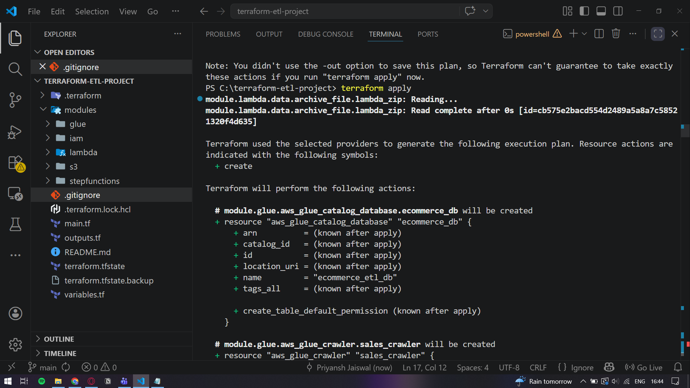
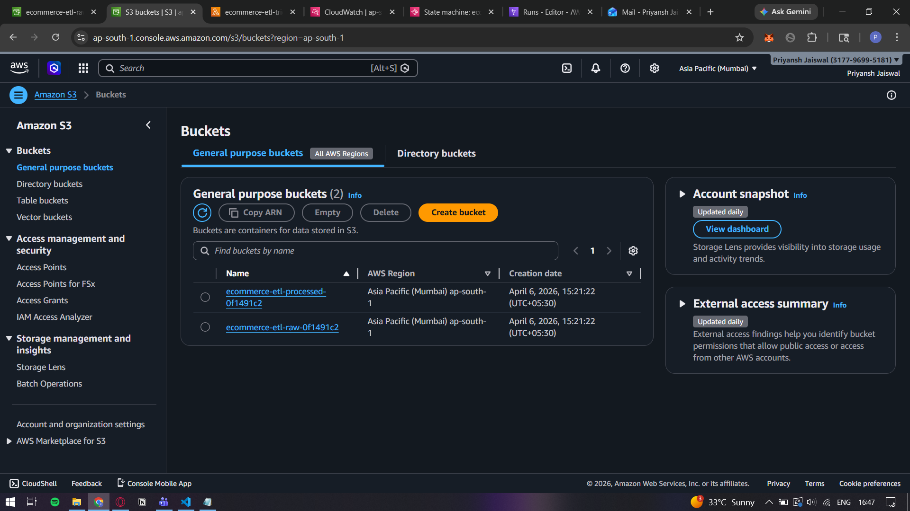
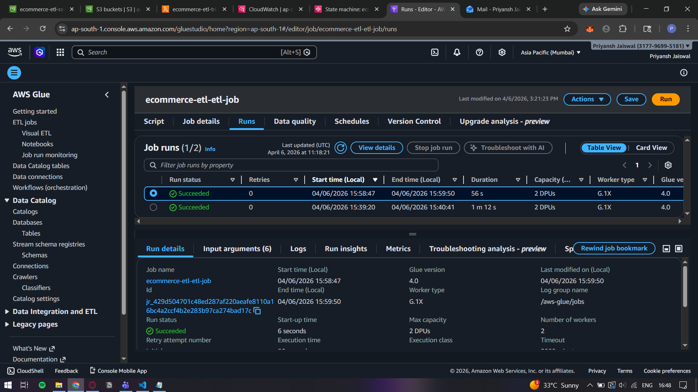
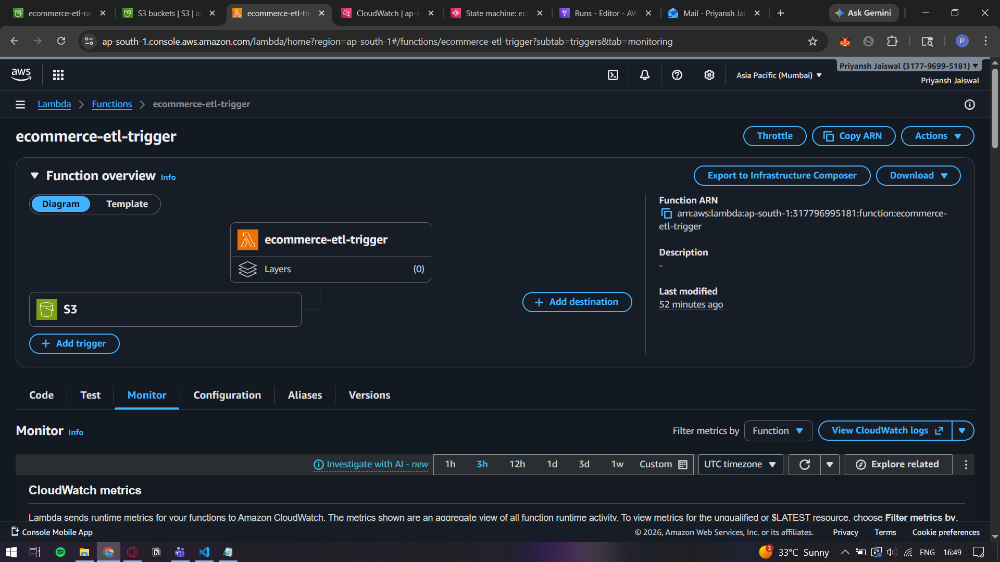
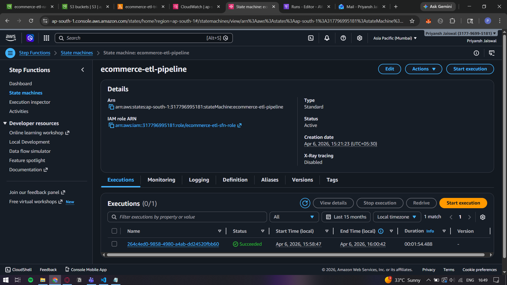
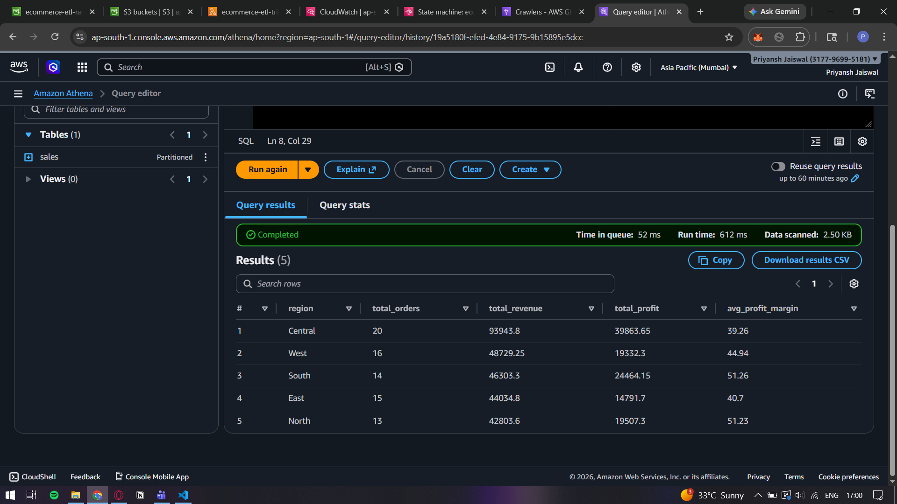
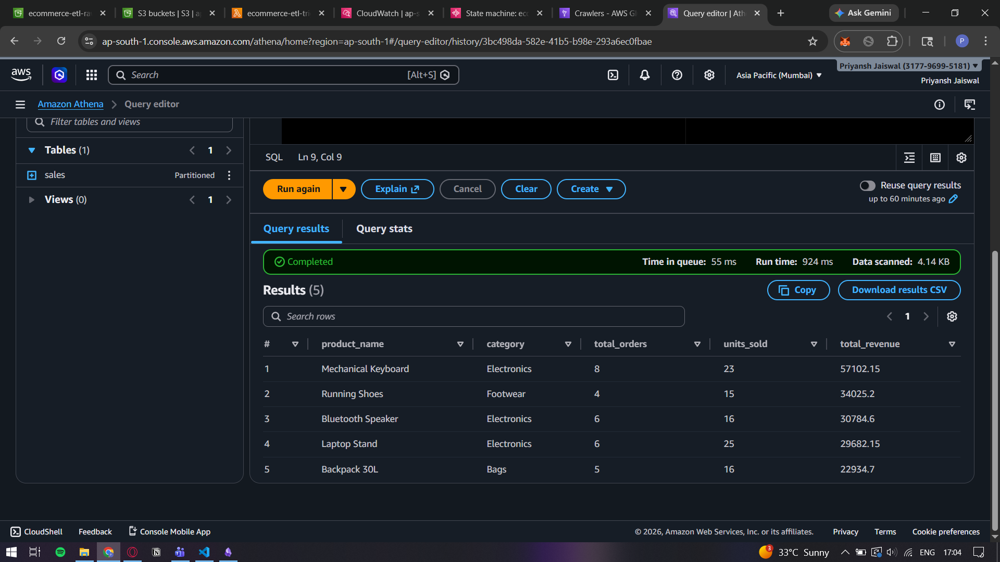
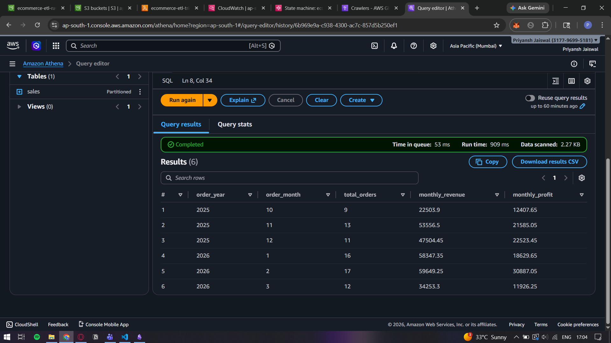

# AWS Serverless ETL Pipeline with Terraform

A fully automated, serverless ETL pipeline deployed on AWS using Terraform (Infrastructure as Code).

## Architecture
CSV Upload → S3 (Raw) → Lambda → Step Functions → AWS Glue (PySpark) → S3 (Parquet) → Athena (SQL)

## Tech Stack
Python | PySpark | SQL | Terraform | AWS S3 | AWS Glue
AWS Lambda | Step Functions | Amazon Athena | IAM

## Project Structure
terraform-etl-project/
├── main.tf
├── variables.tf
├── outputs.tf
└── modules/
    ├── s3/
    ├── iam/
    ├── glue/
    ├── lambda/
    └── stepfunctions/

## How to Deploy
```bash
# Clone the repo
git clone https://github.com/priyansh-jaiswal/aws-etl-pipeline-terraform

# Initialize Terraform
terraform init

# Preview resources
terraform plan

# Deploy everything
terraform apply
```

## How to Destroy
```bash
terraform destroy
```

## Pipeline Flow
1. Raw CSV sales data uploaded to S3 raw bucket
2. S3 triggers Lambda automatically on file upload
3. Lambda starts Step Functions execution
4. Step Functions orchestrates the Glue ETL job
5. Glue cleans and transforms data to Parquet format
6. Processed data partitioned by region and year in S3
7. Athena queries processed data using standard SQL

## Key Transformations
- Removed null and invalid records
- Cast dates and numeric columns to correct types
- Derived new columns: days_to_ship, profit_margin, shipping_speed, order_size, is_profitable
- Separated cancelled orders into dedicated folder
- Output partitioned by region and order year

## Screenshots

### Terraform Apply


### S3 Buckets


### Glue ETL Job


### Lambda Trigger


### Step Functions Execution


### Athena Query Results




## Author
Priyansh Jaiswal  
[GitHub](https://github.com/priyansh-jaiswal)
